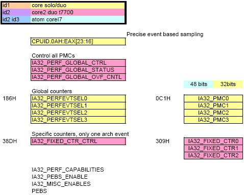

# Nehalem

## Intel x86-64 PMU (Nehalem)

The x86-64 PMUs are specific to each underlying architecture. The Netburst architecture of the Pentium-4 has given way to the Core architecture, in use in Nehalem, i7 processors.

The recent PMUs seem to be somewhat structured similarly across Core and Atom CPU models.

## PMU overview

The diagram of PMU registers shows the registers available depending on which processor family you are using. You are offered at least 4 counters.

The Nehalem PMU supports a hardware bufering scheme to collect multiple samples from the PMU. When a counter overflows, the CPU interrupts into firmware, which in turn copies the counters into a PEBS buffer record. The following graph shows the indirection levels and the content of each record.

